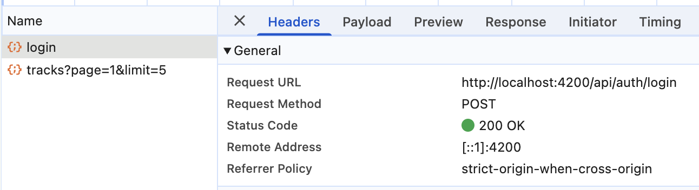
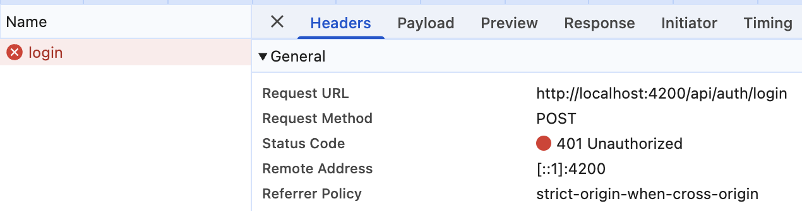
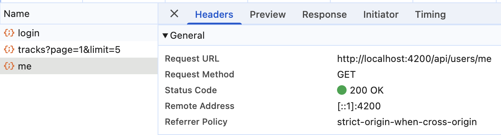
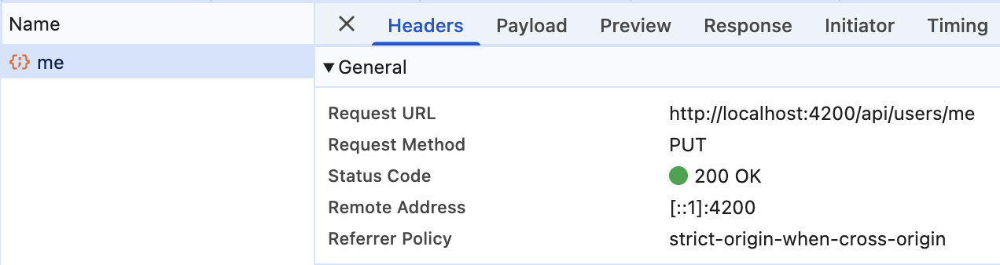

# Livrables TP1 - Authentification et profil

- Schéma annoté du flux de connexion : [frontend-starter/SCHEMA_FLUX_LOGIN.mmd](frontend-starter/SCHEMA_FLUX_LOGIN.mmd)
- Rapport d'usage de l'IA : [RAPPORT_IA_MODELE.md](RAPPORT_IA_MODELE.md)

## 1. Checkpoint Network

Observé dans les DevTools (onglet Network, filtre Fetch/XHR) depuis `http://localhost:4200`.
Les requêtes passent par le proxy Angular (`proxy.conf.json` → `http://localhost:3000`).
Le mot de passe et le JWT ne sont jamais recopiés ici.

### 1.1 Connexion réussie



| Élément | Valeur |
| --- | --- |
| Méthode | `POST` |
| URL | `/api/auth/login` |
| Corps JSON envoyé | `{ "email": "demo@example.com", "password": "<masqué>" }` |
| Statut | `200 OK` |
| Réponse | `{ "token": "<JWT masqué>", "user": { "id": "6aabfeb0…", "name": "Demo", "email": "demo@example.com", "createdAt": "2026-09-17T…" } }` |
| En-tête `Authorization` | Absent : route publique, l'utilisateur n'a pas encore de token |

### 1.2 Connexion refusée



| Élément | Valeur |
| --- | --- |
| Méthode | `POST` |
| URL | `/api/auth/login` |
| Corps JSON envoyé | `{ "email": "demo@example.com", "password": "<mauvais mot de passe, masqué>" }` |
| Statut | `401 Unauthorized` |
| Réponse | `{ "message": "Identifiants incorrects" }` |
| En-tête `Authorization` | Absent |

Le message de la réponse est affiché sous le formulaire. L'intercepteur ne redirige pas vers `/login`, car aucun token n'était envoyé : ce `401` signifie « mauvais identifiants », pas « session expirée ».

### 1.3 Lecture et modification de `/api/users/me`




| Élément | `GET /api/users/me` | `PUT /api/users/me` |
| --- | --- | --- |
| Corps JSON envoyé | aucun | `{ "name": "Demo" }` |
| Statut | `200 OK` | `200 OK` |
| Réponse | `{ "id": "6aabfeb0…", "name": "Demo", "email": "demo@example.com", "createdAt": "…" }` | l'utilisateur mis à jour (même format) |
| En-tête `Authorization` | Présent : `Bearer <JWT masqué>`, ajouté par `authInterceptor` | Présent, idem |

Cas d'erreur vérifiés sur la même route :

| Cas | Statut | Réponse |
| --- | --- | --- |
| Sans `Authorization` | `401` | `{ "message": "Authentification requise" }` |
| Token invalide ou expiré | `401` | `{ "message": "Jeton invalide ou expiré" }` → le front appelle `logout()` et redirige vers `/login` |

### 1.4 Traces côté backend

Les traces du backend s'affichent dans le terminal où tourne `npm start` (dossier `backend/`), pas dans la console du navigateur. Pour la séquence ci-dessus :

```text
[auth] Tentative de connexion pour demo@example.com
[auth] Connexion réussie : 6aabfeb0c9b797aadfbb3894
[auth] Création d'un token pour l'utilisateur 6aabfeb0c9b797aadfbb3894
[http] POST /api/auth/login -> 200 (102 ms)
[auth] Identifiants incorrects pour demo@example.com
[http] POST /api/auth/login -> 401 (88 ms)
[auth] Token accepté pour 6aabfeb0c9b797aadfbb3894
[user] Profil envoyé : 6aabfeb0c9b797aadfbb3894
[http] GET /api/users/me -> 200 (29 ms)
[auth] Token accepté pour 6aabfeb0c9b797aadfbb3894
[user] Nom mis à jour : 6aabfeb0c9b797aadfbb3894
[http] PUT /api/users/me -> 200 (30 ms)
[auth] Authorization absente pour GET /api/users/me
[http] GET /api/users/me -> 401 (0 ms)
```

Le backend journalise la méthode, l'URL, le statut et la durée, mais jamais le corps des requêtes (qui contient les mots de passe).

## 2. Signal ou `localStorage` ?

Dans `AuthService`, les deux sont utilisés ensemble, mais ils n'ont pas le même rôle.

| | Signal (`currentUser`, `token`) | `localStorage` (`gpc_token`) |
| --- | --- | --- |
| Où vit la donnée | En mémoire, dans le service Angular | Dans le navigateur, pour l'origine `localhost:4200` |
| Durée de vie | Perdue au rechargement de la page | Conservée après un rechargement ou une fermeture de l'onglet |
| Réactivité | Oui : les templates qui lisent `auth.currentUser()` se mettent à jour tout seuls quand on appelle `set()` | Non : aucune notification quand la valeur change, il faut la relire |
| Type de valeur | N'importe quel objet TypeScript (`User`) | Chaîne de caractères seulement |
| Rôle dans le projet | Piloter l'interface : nom dans l'en-tête, liens Connexion/Déconnexion, page profil | Garder le JWT pour rester connecté après un rechargement |

Au démarrage, le Signal `token` est initialisé à partir de `localStorage`. À la connexion, on écrit dans les deux. À la déconnexion, on vide les deux.

Point de sécurité : tout script exécuté sur la page peut lire `localStorage`. Une faille XSS permettrait donc de voler le JWT. C'est pour ça qu'on ne l'affiche jamais dans les logs et qu'il expire côté serveur.

## 3. Questions du sujet

### Routes du backend utilisées par la partie utilisateur

| Route | Accès | Utilisée par |
| --- | --- | --- |
| `POST /api/auth/register` | publique | `AuthService.register()` ← `RegisterPageComponent` |
| `POST /api/auth/login` | publique | `AuthService.login()` ← `LoginPageComponent` |
| `GET /api/users/me` | protégée (JWT) | `AuthService.profile()` ← `ProfilePageComponent` |
| `PUT /api/users/me` | protégée (JWT) | `AuthService.update()` ← `ProfilePageComponent` |

`GET /api/health` est publique et sert à vérifier que l'API tourne. Les routes `/api/tracks…` (protégées) servent à la bibliothèque audio.

### Où s'effectue la mise à jour du profil ?

**Côté front :**

1. `frontend-starter/src/app/components/profile-page/profile-page.html` : le formulaire et `(ngSubmit)="save()"`.
2. `frontend-starter/src/app/components/profile-page/profile-page.ts` : `save()` lit le formulaire et appelle `auth.update(name)`.
3. `frontend-starter/src/app/shared/services/auth.service.ts` : `update()` envoie `PUT /api/users/me` avec `HttpClient`, puis met à jour le Signal `currentUser`.
4. `frontend-starter/src/app/shared/interceptors/auth.interceptor.ts` : ajoute `Authorization: Bearer …` et gère le `401`.

**Côté back :** `backend/src/app.js`

1. Le middleware `auth` vérifie le JWT avec `jwt.verify` et place l'identifiant de l'utilisateur dans `req.auth.sub`.
2. La route `app.put("/api/users/me", auth, …)` appelle `User.findByIdAndUpdate` avec `runValidators: true`.
3. Le modèle `backend/src/models/User.js` définit le schéma Mongoose et ses validations.
