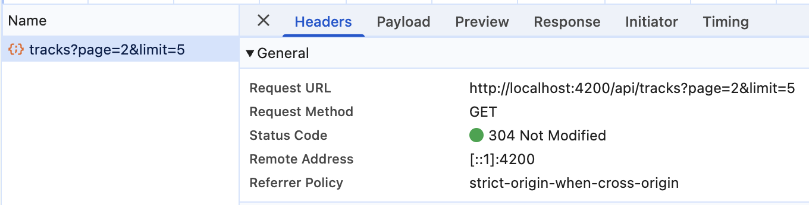

# Livrables TP2 - Bibliothèque, upload et lecture audio

Observations faites dans les DevTools (onglet Network, filtre Fetch/XHR et Media) depuis `http://localhost:4200`.
Les requêtes passent par le proxy Angular (`proxy.conf.json` → `http://localhost:3000`). Le JWT n'est jamais recopié ici.

## 1. Mission 2 - Bibliothèque paginée

Flux : `TracksPageComponent.load()` → `TrackService.list(page, limit)` → `HttpClient.get('/api/tracks', { params: { page, limit } })` → `GET /api/tracks?page=…&limit=…`.

| Élément | Où |
| --- | --- |
| Signals `tracks`, `page`, `limit`, `pages`, `total`, `loading`, `error` | [tracks-page.ts](frontend-starter/src/app/components/tracks-page/tracks-page.ts) |
| Requête serveur à chaque changement de page (`go()` → `load()`) | [tracks-page.ts](frontend-starter/src/app/components/tracks-page/tracks-page.ts) |
| `@if` chargement / erreur, `@for` + `@empty` | [tracks-page.html](frontend-starter/src/app/components/tracks-page/tracks-page.html) |
| Boutons « Précédent » / « Suivant » désactivés aux bornes et pendant le chargement | [tracks-page.html](frontend-starter/src/app/components/tracks-page/tracks-page.html) |

Aucune découpe locale : le composant n'a jamais en mémoire que les `limit` pistes de la page courante. Une requête de liste encore en cours est annulée (`unsubscribe()`) quand une autre page est demandée, pour qu'une réponse lente n'écrase pas la page la plus récente.

### Capture Network de la pagination

| Élément | Valeur |
| --- | --- |
| Méthode | `GET` |
| URL | `/api/tracks?page=2&limit=5` |
| Statut | `304 Not Modified` |
| En-tête `Authorization` | `Bearer <JWT masqué>`, ajouté par `authInterceptor` (dans *Request Headers*, hors du cadre de la capture) |

Le clic sur « Suivant » modifie bien le paramètre `page` et déclenche une nouvelle requête HTTP. Le `304` n'indique pas que la requête a été évitée : la page 2 avait déjà été demandée, le navigateur a renvoyé l'ETag reçu la première fois (`If-None-Match`), et Express a répondu que le contenu n'avait pas changé. Le navigateur réutilise alors le JSON en cache. Au premier affichage de la page 2, ou après un upload, la réponse est un `200` avec le JSON.

## 2. Mission 3 - Analyse du flux d'upload et de lecture

### 2.1 Où se trouve chaque étape

| Étape | Fichier et méthode |
| --- | --- |
| Choix du fichier | `<input type="file" (change)="choose($event)">` dans [tracks-page.html](frontend-starter/src/app/components/tracks-page/tracks-page.html), puis `choose()` dans [tracks-page.ts](frontend-starter/src/app/components/tracks-page/tracks-page.ts) |
| Validation frontend | `validateAudioFile()` dans [audio-file.ts](frontend-starter/src/app/shared/utils/audio-file.ts), appelée dans `choose()` et de nouveau dans `upload()` |
| Construction du `FormData` | `TrackService.upload()` dans [track.service.ts](frontend-starter/src/app/shared/services/track.service.ts) : `append('audio', file)` et `append('title', title)` |
| Appel HTTP d'upload | `this.http.post<Track>('/api/tracks', body)` dans `TrackService.upload()` |
| Récupération du `Blob` | `TrackService.audio(id)` avec `responseType: 'blob'` |
| Création de l'`ObjectURL` | `TracksPageComponent.play()` : `URL.createObjectURL(blob)` |
| Affectation au lecteur | `<audio [src]="audioUrl()" controls autoplay (error)="onAudioError()">` |
| Révocation de l'ancienne URL | `revokeAudioUrl()`, appelée dans `play()` avant de créer la nouvelle URL, et dans `DestroyRef.onDestroy` pour la dernière URL |
| Ajout du JWT | `authInterceptor` dans [auth.interceptor.ts](frontend-starter/src/app/shared/interceptors/auth.interceptor.ts), enregistré par `provideHttpClient(withInterceptors([authInterceptor]))` dans [main.ts](frontend-starter/src/main.ts) |

### 2.2 Flux

**Upload** : composant (`upload()`) → `TrackService.upload(file, title)` construit le `FormData` → `HttpClient.post` → `authInterceptor` ajoute `Authorization: Bearer …` → `POST /api/tracks` en `multipart/form-data` → Multer (`upload.single("audio")`) écrit le fichier sur disque → Mongoose enregistre les métadonnées → `201 Track`. Le composant affiche alors un message de succès, vide le formulaire et recharge la page 1.

**Lecture** : composant (`play(track)`) → `TrackService.audio(id)` → `HttpClient.get(..., { responseType: 'blob' })` → `authInterceptor` ajoute le JWT → `GET /api/tracks/:id/audio` → le backend vérifie que la piste appartient à l'utilisateur, puis `res.sendFile()` → le navigateur reçoit tout le corps → `Blob` → `URL.createObjectURL(blob)` donne une URL `blob:http://localhost:4200/…` → `<audio [src]>` lit cette URL locale, sans nouvelle requête réseau.

### 2.3 Pourquoi une URL directement dans `src` ne reçoit pas le JWT

Avec `<audio src="/api/tracks/:id/audio">`, la requête n'est pas faite par `HttpClient` : c'est le moteur multimédia du navigateur qui la lance. Les intercepteurs Angular ne voient donc que les requêtes passées par `HttpClient`. En plus, un élément `<audio>` ne permet pas de définir des en-têtes HTTP. La requête partirait sans `Authorization` et le backend répondrait `401 Authentification requise` (vérifié avec curl). Passer par `HttpClient` + `Blob` + `ObjectURL` permet de garder l'authentification par en-tête sans mettre le token dans l'URL : il se retrouverait sinon dans l'historique, les logs serveur et l'en-tête `Referer`.

### 2.4 Contrôles backend et validation frontend

Contrôles déjà présents dans [backend/src/app.js](backend/src/app.js) :

| Contrôle | Code backend | Réponse |
| --- | --- | --- |
| Présence du fichier dans le champ `audio` | `upload.single("audio")` puis `if (!req.file)` | `400 Fichier audio requis` |
| Lecture du champ `title` | `req.body.title \|\| req.file.originalname` | titre par défaut = nom du fichier |
| Formats acceptés | `fileFilter` + `allowed` (`audio/mpeg`, `audio/wav`, `audio/x-wav`, `audio/ogg`, `audio/mp4`, `audio/x-m4a`) | `400 Format audio non accepté` |
| Taille maximale | `limits: { fileSize: MAX_FILE_SIZE }` (25 Mo) | `400 File too large` (`MulterError`) |
| Propriété de la piste | `Track.findOne({ _id, ownerId: req.auth.sub })` | `404 Piste inconnue` |

Le frontend construit bien le `FormData` avec exactement `audio` et `title`. [audio-file.ts](frontend-starter/src/app/shared/utils/audio-file.ts) reprend les mêmes règles (mêmes types MIME, 25 Mo). L'attribut `accept` de l'input est généré à partir de cette liste.

**Pourquoi la validation frontend ne remplace pas celle du backend.** La validation frontend évite d'envoyer 25 Mo pour rien et donne un message immédiat et précis : c'est du confort utilisateur. Mais tout ce qui tourne dans le navigateur peut être contourné (DevTools, `curl`, script, client modifié). L'API reste accessible directement, donc seul le serveur peut garantir l'intégrité des données et protéger le disque. Remarque : le type MIME vérifié des deux côtés est celui *déclaré* par le client. Une vérification plus stricte analyserait le contenu du fichier côté serveur.

### 2.5 Interface ajoutée

- Upload : bouton « Envoi en cours… » désactivé, titre désactivé, garde `if (this.uploading()) return` contre les doubles soumissions, erreur de validation ou du serveur (`role="alert"`), message de succès (`role="status"`), formulaire vidé (titre et input fichier), puis rechargement de la page 1.
- Cards : composant [track-card](frontend-starter/src/app/components/track-card/) avec le titre, le nom original, le format, la taille lisible (Ko/Mo au lieu d'octets), la date d'ajout et un bouton de lecture avec `aria-label`. Grille `auto-fill` responsive, liste sémantique `<ul>/<li>`, focus visible, `aria-current` sur le morceau en cours.
- Lecture : « En cours : titre », bouton « … » pendant le téléchargement du morceau, erreurs HTTP traduites (401, 404, serveur injoignable), erreur du lecteur (`(error)` sur `<audio>`) et révocation de la dernière `ObjectURL` quand le composant est détruit.

## 3. Mémoire, buffering et streaming

**Blob, buffering, streaming : les différences.**
- *Téléchargement complet d'un Blob* : le client récupère tous les octets avant de pouvoir s'en servir.
- *Buffering du navigateur* : quand `<audio>` lit une URL HTTP, le navigateur télécharge juste assez d'avance pour lire sans coupure, et démarre avant la fin.
- *Streaming côté serveur* : le serveur envoie le fichier par morceaux depuis le disque au lieu de le charger en entier en mémoire. Il peut aussi répondre à des requêtes `Range` pour n'envoyer qu'une partie.

**Le backend envoie-t-il le fichier entier en mémoire ?** Non. `res.sendFile()` (module `send` d'Express) lit le fichier sur le disque avec un flux (`fs.createReadStream`) et l'envoie par morceaux. Il gère aussi `Range`. Vérifié : la réponse contient `Accept-Ranges: bytes`, et une requête `Range: bytes=0-99` renvoie `206 Partial Content`. La mémoire du serveur ne dépend donc pas de la taille du fichier.

**Avec `HttpClient` et `responseType: "blob"`, quand le composant reçoit-il le fichier ?** Seulement quand la réponse a été *entièrement* téléchargée : `next(blob)` n'est appelé qu'une fois, à la fin. Pour un MP3 de 6 Mo, le lecteur n'apparaît qu'après le téléchargement complet, et tout le fichier est en mémoire dans le navigateur. Le streaming du serveur ne sert donc pas à démarrer la lecture plus tôt.

**100 morceaux dans la bibliothèque : sont-ils tous chargés en mémoire ?** Non.
1. La liste est paginée : `GET /api/tracks` ne renvoie que `limit` pistes (5 par défaut, 20 maximum côté backend).
2. Elle ne contient que des métadonnées JSON (titre, taille, type…). Le backend exclut même `storedName`.
3. L'audio n'est téléchargé que dans `play()`, donc au clic. Chaque card n'a qu'un bouton, pas d'élément `<audio>`.
4. Il n'y a qu'un seul `<audio>` et un seul `Blob` actif. L'`ObjectURL` précédente est révoquée avant d'en créer une nouvelle.

**Et avec 100 éléments `<audio>` utilisant directement une URL HTTP ?**
- Chaque élément déclencherait sa propre requête selon `preload` (par défaut, souvent `metadata`, voire `auto`) : jusqu'à 100 requêtes au chargement de la page.
- En contrepartie, la lecture serait progressive : buffering, lecture qui démarre avant la fin du téléchargement, déplacement dans le morceau via `Range`, sans garder tout le fichier en mémoire.
- Mais ici, ça ne marcherait pas : ces requêtes partent sans l'en-tête `Authorization` et recevraient toutes un `401`. Il faudrait une autre authentification, comme un cookie de session ou une URL signée à courte durée de vie.

**Pourquoi révoquer l'URL créée par `URL.createObjectURL` ?** Une `ObjectURL` garde une référence vers le `Blob` dans le document. Tant qu'elle n'est pas révoquée, le navigateur ne peut pas libérer ces octets, même si plus aucune variable ne pointe vers le `Blob`. Ils ne sont libérés qu'à la fermeture de l'onglet. Sans `revokeObjectURL`, écouter 20 morceaux de 6 Mo garderait environ 120 Mo en mémoire. On révoque donc l'ancienne URL à chaque nouvelle lecture, et la dernière quand le composant est détruit.

## 4. Checkpoint Network

La pagination est documentée par la capture de la section 1. Les autres points ont été vérifiés en appelant directement l'API avec `curl` (compte `demo@example.com`) :

| Vérification | Résultat observé |
| --- | --- |
| Changement de page | `GET /api/tracks?page=2&limit=5` (voir la capture de la section 1) |
| Upload multipart | Le frontend envoie un `FormData` (`multipart/form-data; boundary=…`) avec les champs `audio` et `title` (`TrackService.upload()`) |
| Lecture | `GET /api/tracks/:id/audio` avec JWT → `200`, `Content-Type: audio/mpeg`, `Accept-Ranges: bytes` ; avec `Range: bytes=0-99` → `206 Partial Content` |
| Fichier invalide | Fichier texte → `400 {"message":"Format audio non accepté"}` ; sans fichier → `400 {"message":"Fichier audio requis"}`. Dans l'interface, la validation frontend affiche le message avant tout envoi. |
| Propriétaire uniquement | Sans JWT → `401 {"message":"Authentification requise"}`. La route filtre sur `ownerId: req.auth.sub` : la piste d'un autre utilisateur donne `404 Piste inconnue` (garanti par le code, non testé avec un second compte). |
